## Part 1. Инструмент ipcalc
- Поднимаю виртуалку **ws1**
- Устанавливаю ipcalc
    - **sudo apt install ipcalc**

- ### 1.1 Сети и маски:
    - **Определяю и пишу в отчёт:**

    1) Адрес сети **192.167.38.54/13**
        - Прожимаю **ipcalc 192.167.38.54/13** \
        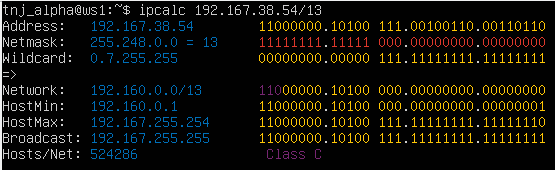

    2) Перевожу маску **255.255.255.0** в префиксную и двоичную запись:
        - Прожимаю **ipcalc 255.255.255.0** \
        - Префиксная /24
        - Двоичная 11111111.11111111.11111111.00000000 \
            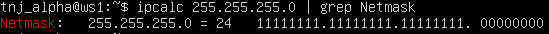 \
             В префиксной записи маска этой подсети обозначается как **/24**

    - **/15** в обычную и двоичную:
        - Прожимаю **ipcalc 255.255.255.0/15**
        - 255.254.0.0 обычная
        - Двоичная 11111111.11111110.00000000.00000000 \
            
        

    - **11111111.11111111.11111111.11110000** в обычную и префиксную:
        - Прожимаю **ipcalc 255.255.255.0/28**
        - 255.255.255.240 обычная
        - Префиксная /28 \
        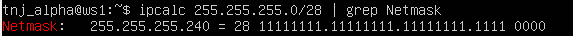
    
    3) Минимальный и максимальный хост в сети **12.167.38.4** при:
        - При масках **/8**:
            - **ipcalc 12.167.38.4/8 | grep 'HostMin\|HostMax'** 
            - min 12.0.0.1
            - max 12.255.255.254 \
            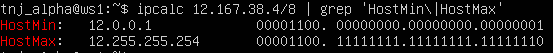

        - При маске **11111111.11111111.00000000.00000000**, тоесть префиксная **/16**:
            - **ipcalc 12.167.38.4/16 | grep 'HostMin\|HostMax'** 
            - min 12.167.0.1
            - max 12.167.255.254 \
            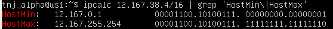

        - При маске **255.255.254.0**:
            - **ipcalc 12.167.38.4 255.255.254.0 | grep 'HostMin\|HostMax'** 
            - min 12.167.38.1
            - max 12.167.39.254 \
            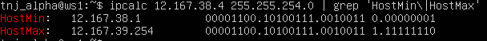

        - И маске **/4**:
            - **ipcalc 12.167.38.4 255.255.254.0 | grep 'HostMin\|HostMax'** 
            - min 0.0.0.1
            - max 15.255.255.254 \
            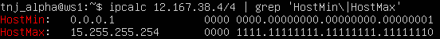

---
- ### 1.2 localhost
- Определяю можно ли обратиться к приложению работающему на localhost со следующими IP:

    - Если можно, то адреса будут находится в диапозоне **от 127.0.0.1 до 127.255.255.254** (HostMin/HostMax) 
    - **ipcalc 127.0.0.0 | grep 'HostMin\\|HostMax'** \
    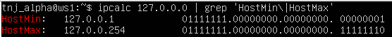
    
    - Можно ещё пингануть эти адреса: \
    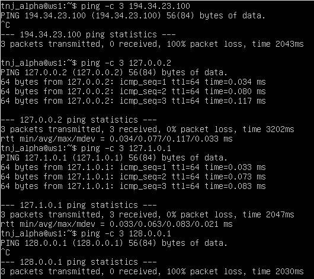
    
    - Итог:
        - 194.34.23.100 - нельзя
        - 127.0.0.2 - можно
        - 127.1.0.1 - можно
        - 128.0.0.1 - нельзя

---

- ### 1.3 Диапозоны и сегменты сетей

1) Какие IP можно использовать как публичные, а какие как частные?

    - Узнаём прожимая команду:
        - **ipcalc [address] | grep 'Hosts\Net'** \
        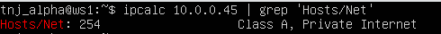

        - 10.0.0.45 - частный
        - 134.43.0.2 - публичный
        - 192.168.4.2 - частный
        - 172.20.250.4 - частный
        - 172.0.2.1 - публичный
        - 192.172.0.1 - публичный
        - 172.68.0.2 - публичный
        - 172.16.255.255 - частный
        - 10.10.10.10 - частный
        - 192.169.168.1 - публичный
    
2) Какие IP адресов шлюза возможны у сети **10.10.0.0/18?**

- Узнаём через:
    - **ipcalc 10.10.0.0/18 | grep \HostMin\\|HostMax'** \
        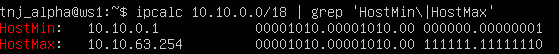
    - Доступный диапозон: **10.10.0.1 - 10.10.63.254**, тоесть:
        - 10.0.0.1 - нет, не возможен
        - 10.10.0.2 - да, возможен
        - 10.10.10.10 - да 
        - 10.10.100.1 - нет
        - 10.10.1.255 - да

## Part 2. Статическая маршрутизация между двумя машинами
- ### Поднимаю две виртуалки: **ws1 и ws2** 
    

- ### Смотрю существующие сетвые интерфейсы
    - Через команду:
        - **ip a**
        - Вывод на **ws1**: \
        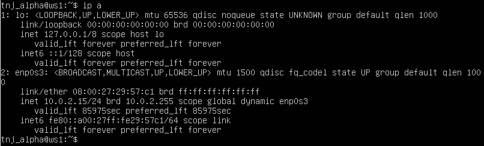
        - Вывод на **ws2**: \
        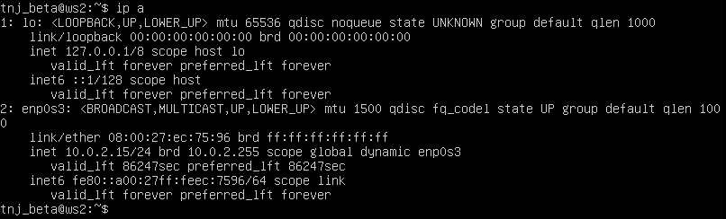

- ### Описываю сетевой интерфейc..
    - Задаю IP адреса и маски:
        - На **ws1**: 192.168.100.10/16 \
        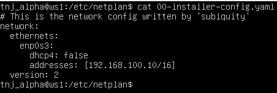
        - На **ws2**: 172.24.116.8/12 \
        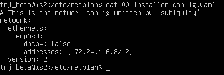

- ### Выполняю команду:
    - **netplan apply** \
    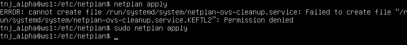 \
    
        - Без **sudo** не прожимается, по сему прожал с **sudo**
        

- ### 2.1 Добавление статического маршрута вручную

    - Добавляю статич маршрут туда и обратно через команду:
        - **ip r add** \
        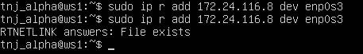 \
        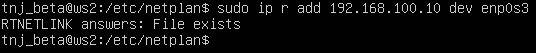
    
    - Пингую соединение между машинами:
        - От **ws1** до **ws2**: \
        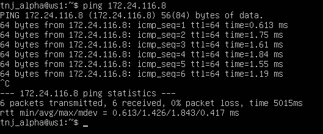
        - От **ws2** до **ws1**: \
        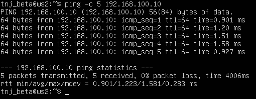

- ### 2.2. Добавление статического маршрута с сохранением
    - Ребутаю машины командой:
        - **sudo reboot**
    - Добавляю статический маршрут черех **.yaml** файл в **etc/netplan**:
        - Для **ws1**: \
        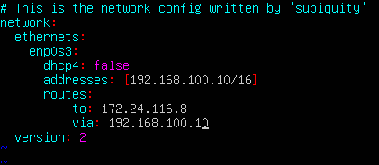
        - Для **ws2**: \
        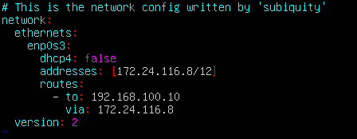
    - Применяю netplan на обоих машинах через:
        - **sudo netplan try**
        - **sudo netplan apply**
    > **Важное замечание!** Перед началом этого таска (или перед пингом) надо в **настройках Virtual Box**, в настройках каждой машины выставить во вкладке **Network** Adapter на **Internal Network**, чтобы создать локальную сеть. 
    > - Получается установки такие:
    > - **Adapter 1** идёт **NAT**, (выход в сеть, интернет)
    > - **Adapter 2** идёт **Internal Network** (локалка, связь между машинами)
    > 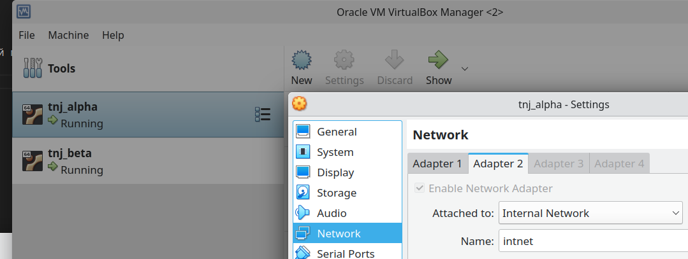
    > - Соответственно и **yaml** файл меняется \
    >   - Для **ws1** \
    > 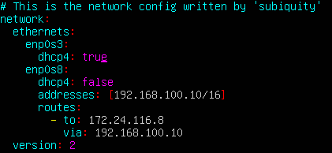
    >   - Для **ws2** \
    > 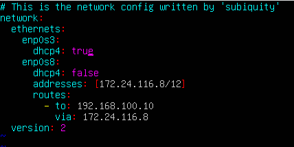 \
    > Узнать корректный **enp0s** номер можно через **ip a** \
    > После этого будет и интернет и локалка! noice.

    - Пингую друг друга:
        - с **ws1** на **ws2** \
        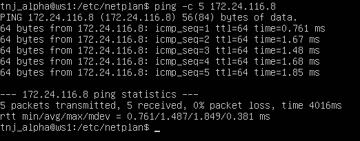
        - с **ws2** на **ws1** \
        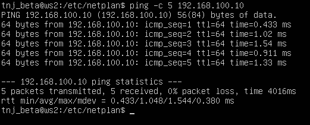

## Part 3. Утилита iperf3

- ### 3.1 Скорость соединения
- Бит(**bit**) это базовая единица измерения информации в digital мире. Один бит может иметь только два значения: 0 или 1.
- Байт(**byte**) состоит из 8 бит. Стандрат для измерения данных в digital, для измерения размера, обьёма памяти, и скорости передачи.
- Мегабайт(**MB**) состоит из 1 миллиона байт(6 нулей). Юзается много где
- Гигабайт(**GB**) состоит из 1 миллиарда байт (9 нулей)
- Есть ещё КилоБиты(**Kb**) и МегаБиты(**Mb**) которые основаны на битах (а не байтах)

    - Конвертирую:
        - 8 Mbps = 1 MB/s
        - 100 MB/s = 819200 Kbps
        - 1 Gbps = 1024 Mbps

- ### Утилита iperf3

- #### Чо эт ваще за утилита?
    - Эт кароч кроссплатформенная утилита, для измерения пропускной способности между двумя точками. Работает в режиме клиент-сервер, изза чего позволяет проверять в обоих направлениях.
        - Чтобы использовать эту утилиту, нужно установить её на обоих машинах, 
        - Затем одну машину запустить в режиме **сервера**
        - А другую в режиме **клиента**

- Измеряю скорость соединения между **ws1** и **ws2**
    - Запускаю **ws1** в режиме сервера через
        - **iperf -s** (надо будет apt install её тоже) \
            - **-s** в режиме сервера \
        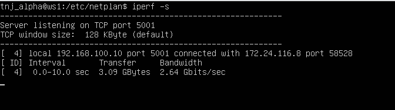
    - Коннектюсь к **ws1** через **ws2** юзая команду
        - **iperf -c 192.168.100.10** \
            - **-c** в режиме клиeнта \
        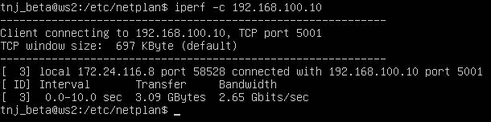 
    - То же самое но в обратную сторону (от **ws1** коннект к **ws2**):  \
        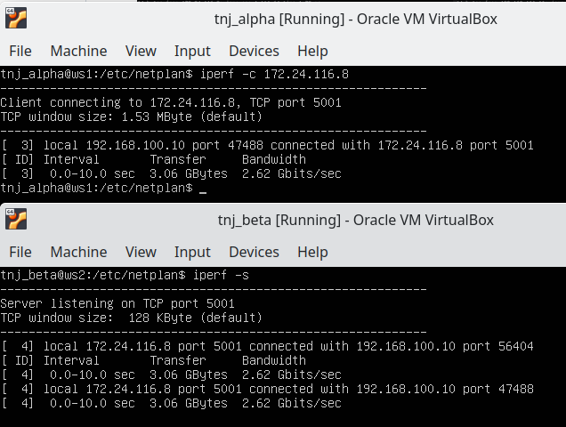 
- Скорость соединения соответственно:
    - **2.65Gbits/s** от ws1 к ws2
    - **2.62Gbits/s** от ws2 к ws1

## Part 4. Сетевой экран

- ### 4.1 Создаю имитацию фаерволла с правилами
    - Создаю файл **firewall.sh** в /etc/
    - Добавляю туда правила:
        - Запрещающее и разрешающее правило на **ws1** и **ws2**
        - Открываю на машинах доступ для порта **22(ssh)** и **80(http)**
        - Блокировка на OUTPUT
        - Разрешение на пингование
    - И надо заксриншотить содержимое **firewall.sh**:
        - **ws1** firewall.sh: \
        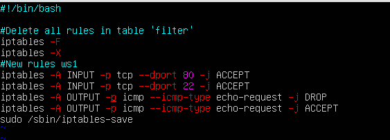
        - **ws2** firewall.sh: \
        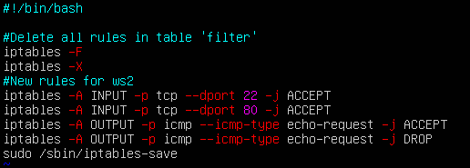
    - Даю права на запуск через:
        - **chmod +x /etc/firewall.sh**
    - Запускаю имитацию фаерволла через:
        - **sudo bash /etc/firewall.sh**
    
    - Вывод этой команды скриншотю:
        - На **ws1**: \
        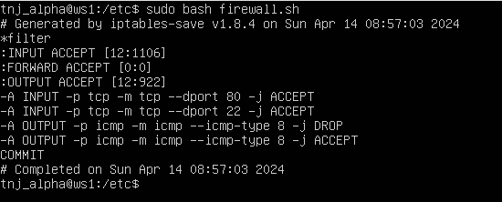
        - На **ws2**: \
        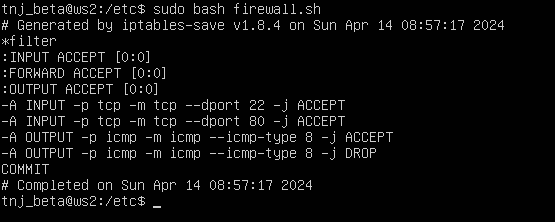
    
    - Разница между этими стратегиями? 
    - В том что очерёдность правил важна. На **первой** машине первым пройдёт правило на **DROP**, и оно применится. А на **второй** машине первым придёт правило **ACCEPT** и оно применится.

- ### 4.2 Утилита nmap
    - Ищу через **ping** то что не пингуется, затем через **nmap** показываю что хост запущен:
    - Скриншоты команд:
        - **ws1** пингую: \
        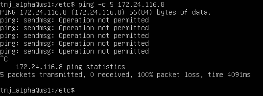
        - **ws1** nmap: \
        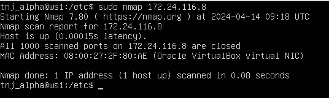

        - **ws2** пингую: \
        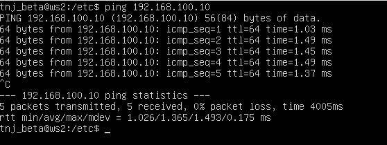
        - **ws2** nmap: \
        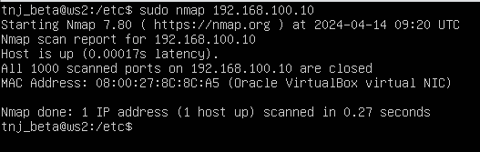

    - Сохранить дампы образов виртуальных машин..

## Part 5. Статическая маршрутизация сети

- Поднимаю **пять** виртуальных машин:
    - **три** рабочие станции
        - ws11
        - ws21
        - ws22
    - **два роутера**
        - r1
        - r2
-  По сути просто в Oracle Virtual Box жмакаю правой кнопкой на ВМ-ке и делаю клонирование машины три раза
    - Затем включаю каждую из них и через команды:
        - **sudo hostnamectl set-hostname %имя%**
        - **sudo reboot**
    - Ставлю им имена эти - **r1, r2, ws11, ws22, ws21**

- После этого настраиваю сетку между ними в Oracle Virtual Box через настройки каждой машины **(Settings -> Network)**:
    - **ws11**
        - Adapter 1 - **NAT**
        - Adapter 2 - **Internal Network, intnet_1**
    - **ws22**
        - Adapter 1 - **NAT**
        - Adapter 2 - **Internal Network, intnet_3**
    - **ws21**
        - Adapter 1 - **NAT**
        - Adapter 2 - **Internal Network, intnet_3**
    - **r1**
        - Adapter 1 - **NAT**
        - Adapter 2 - **Internal Network, intnet_1**
        - Adapter 3 - **Internal Network, intnet_2**
    - **r2**
        - Adapter 1 - **NAT**
        - Adapter 2 - **Internal Network, intnet_2**
        - Adapter 3 - **Internal Network, intnet_3**

- ### 5.1 Настройка адресов машин

- Отчёт со скринами содержимого **etc/netplan/00-installer-config.yaml** файлика:
    - **r1** \
    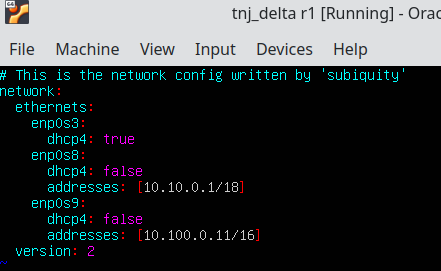
    - **r2** \
    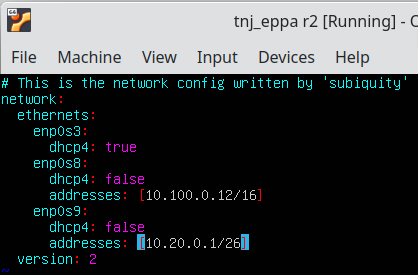
    - **ws11** \
    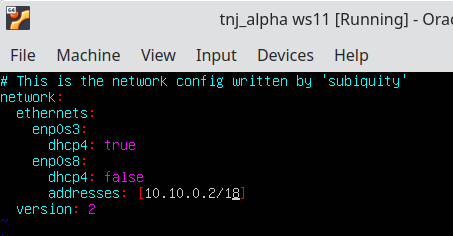
    - **ws22** \
    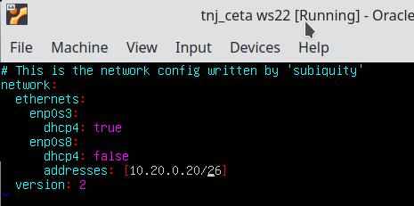
    - **ws21** \
    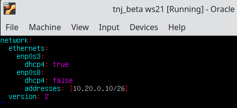

- Перезапускаю сервис сети через
    - **sudo netplan try**
    - **sudo netplan apply**

- Проверяю что всё задано верно через команду 
    - **ip -4 a**

- И вывожу скрины с выводом **ip -4 a**:
    - **ws11** \
    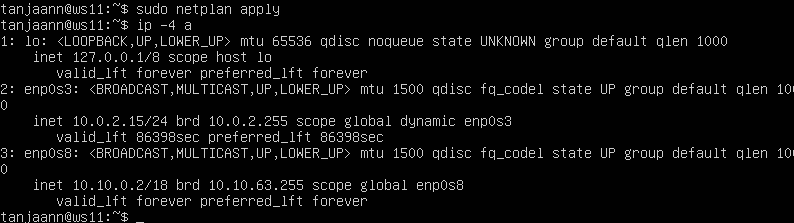
    - **ws21** \
    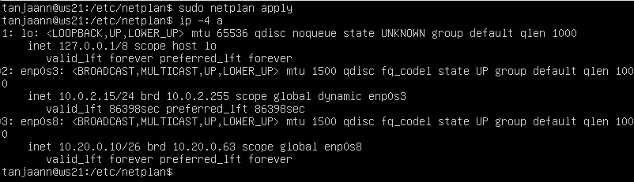
    - **ws22** \
    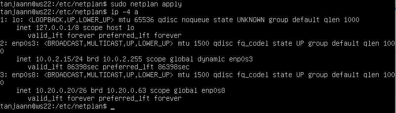
    - **r1** \
    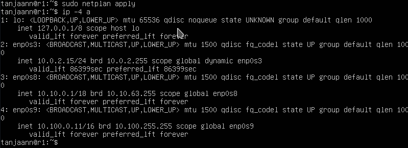
    - **r2** \
    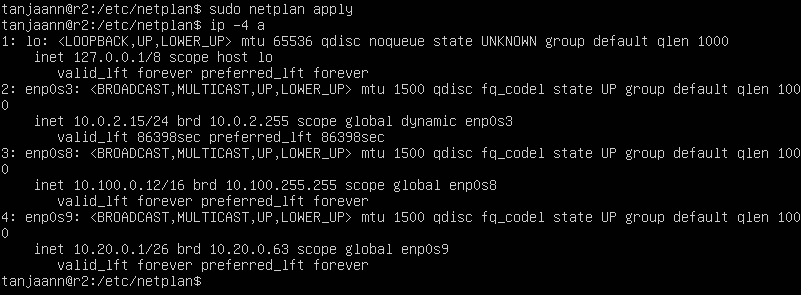

    - Адреса получились такие:
        - ws11 - 10.10.0.2
        - ws21 - 10.20.0.10
        - ws22 - 10.20.0.20
        - r1 два адреса так как он соединяет две сетки
            - 10.10.0.1
            - 10.100.0.11
        - r2 тож роутер поэтому два адреса
            - 10.100.0.12 
            - 10.20.0.1

- Затем скрины с пингом:
    - Пинг с **ws22** на **ws21**: \
    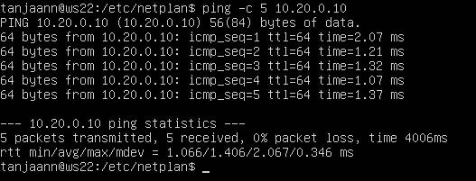

    - Пинг с **r1** на **ws11**: \
    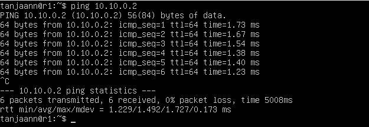

- ### 5.2 Включение переадресации IP-адресов

- Прожимаю команду на **r1** и **r2**
    - **sudo sysctl -w net.ipv4.ip_forward=1**

- Скриншот с выводом команды: \
    

- Постоянная переадресация через файл */etc/sysctl.conf*
    - И добавление в него строки:
        - **`net.ipv4.ip_forward = 1`**

    - На **r1**: \
    
    - На **r2**: \
     \
    > По сути прост раскомментил одну строчку в файле, там уже всё было

- ### 5.3 Установка маршрута по умолчанию

- Настраиваю машрут по умолчанию (gateway) для **ws11, ws21, ws22**
    - Через наш любимый **yaml** файлик:
        - **ws11** \
        
        - **ws21** \
        
        - **ws22** \
        

- Также вот состояние r1 и r2:
    - **r1:** \
    
    - **r2:** \
    
    > Только так смог сделать чтоб пинговался **r2** с **ws11**

- Прожимаю ip r и показываю что наш гейтвэй добавлен:
    - Команда **ip r | grep default**
    - (хотя кжс можно и не грэпать)
        - **ws11** \
        
        - **ws21** \
        
        - **ws22** \
        

- Теперь всё это дело пингуем:
    - Вывод на **r2** с командой 
        - **sudo tcpdump -tn -i enp0s8** \
        
        - Вывод пинга идущего с **ws11:** \
        

- ### 5.4 Добавление статических маршрутов

- Добавляю в роутеры статические маршруты в yaml.
    - yaml файлик на **r1**: \
    
    - yaml файлик на **r2**: \
    

- Вызываю **ip r**
    - Скриншот с **r1** \
     
    - Скриншот с **r2** \
    

- Запускаю команды на **ws11** \
    - **ip r list 10.10.0.0/18** 
    - **ip r list 0.0.0.0/0** \
     

- Почему для адреса **10.10.0.0/18** был выбран маршурт отличный от 0.0.0.0/0?
    - Потомучто он более низкий по приоритету
    - И потомучто при наличии нескольких маршрутов одинаковой длинны выбирается тот который задан точно 

- ### 5.5 Построение списка маршрутизаторов

- Запускаю на **r1** команду:
    - **sudo tcpdump -tnv -i enp0s8**

- Затем трэйсрутаю с **ws11** до **ws21**
    - **sudo traceroute 10.20.0.10** 
    - (кстати traceroute ещё установить надо) \
    
    - И получаю дамп на **r1** \
    

- Traceroute использует UDP-пакеты для определения пути к целевому хосту, отправляя их с увеличивающимся значением TTL. При этом, каждый пакет направляется на порт, который по умолчанию равен 34434, но может быть изменен. Когда пакет достигает целевого хоста, хост отправляет сообщение об ошибке "Destination port unreachable", что указывает на успешное получение пакета. Это позволяет Traceroute определить, что пакет достиг цели, и завершить трассировку.

- ### 5.6 Использование протокола ICMP при маршрутизации

- Запускаю на **r1** перехват сетевого трафика проходящего через enp0s8:
    - Прожимаю команду
        - **sudo tcpdump -n -i enp0s8 icmp** \
        
        - Пингую на **ws11** несуществующий IP: \
        

## Part 6. Динамическая настройка IP с помощью **DHCP**

- Сначала кстати надо будет установить **dhcp** через:
    - **sudo apt install isc-dhcp-server**

- 1) Указываю адрес машрутизатора по умолчанию, DNS, и адрес внутренней сети для **r2** \

- 2) В файле /etc/resolv.conf пишу **nameserver 8.8.8.8** \

    - Перезагружаю DHCP командой:
        - **systemctl restart isc-dhcp-server** \
        
        > Кстати срабатывает только после ребута ВМки

    - Машину **ws21** ребутаю и прожимаю **ip a** \
    

    - Затем отправляю пинг с **ws21** на **ws22** \
    

- Указываю MAC адрес у **ws11**
    - В нашем любимом **yaml** файле: \
    
    - И в настройках **VM Oracle**
    

- Настраиваю **r1** аналогично **r2**
    - **dhcpd.conf:** \
    
    - Ребутаю DHCP: \
    

- Аналогичный тест на **ws11**
    - **ip a** \
    
    - И пингуем: \
     

- Запрашиваю обновление IP адреса с **ws21**
    - Запрашиваю обновления командой **sudo dhclient enp0s8** \
    

    - #### До обновы: 
    
    - #### После обновления: 
    

- Какие опиции **DHCP** я юзал в данном пунтке?
    - **sudo dhclient -r enp0s3** для того чтоб освободить текущий интерфейс
    - **sudo dhclient enp0s3** для того чтоб задать новый адрес указанному интерфейсу

- ## Part 7. NAT
- Сначала надо установить apache2
    - **sudo apt install apache2**

- Если инета нет, то в yaml файле меняешь dhcp с false на true или выключаешь уже включенный dhcp (ну или прост вырубаешь в настройках ВМ)

- Меняю строку в файле **/etc/apache2/ports.conf**
    - На **ws22:** \
    

    - И на **r1** \
    

- Запускаю apache на **ws22** и **r1**
    - **service apache2 start**
        - **ws22** \
        
        - **r1** \
        

- Добавляю в фаерволл из **Part 4** на **r2** следующие правила:
    - Удаление правил в таблице **filter - iptables -F;**

    - Удаление правил в таблице "NAT" - **iptables -F -t nat;**

    - Отбрасывать все маршрутизируемые пакеты - **iptables --policy FORWARD DROP**

- В результате **firewall.sh** на машине **r2** выглядит таким образом: \
    
    - Затем даём ему права запуска, и запускаем его командами:
        - **sudo chmod +x firewall.sh** 
        - **sudo bash firewall.sh** \
        
        - Командой **sudo iptables -L** проверяем какие правила включены

- Пингую **r1** с **ws22** \
     \
     

- Подключаюсь к серверу apache2 с **r1** на **ws22** \
    

- Подключаюсь наоборот, от **ws22** к **r1** \
    

- ## Part 8. Дополнительно. Знакомство с SSH Tunnels

- #### Запускаю **firewall.sh** из части 7 на **r2**
    - **sudo bash /etc/firewall.sh** \
    -

- #### Запускаю веб-сервер Apache

    - Сначала меняю в **etc/apache2/ports.conf** на **ws22** строчку:
        - **Listen 80**
        - на строчку
        - **Listen localhost:80** \
        

    - Затем прожимаю **service apache2 start**

    - На каждой из машин **ws11, ws22, ws21**:
        - В файле etc/ssh/sshd_config:
            - Раскомменчиваем:
                - **Port 22**
                - **ListenAddress 0.0.0.0**
                - **ListenAddress : :**
        
        
        
        

    - Запускаем **sshd** на трёх машинах, используя:
        - **sudo systemctl restart sshd**
        - **sudo systemctl status sshd**
            - На **ws22** \
            

            - На **ws11** \
            

            - И на **ws21** \
            

- #### Прожимаю подключение по **SSH**:
    - Тип соединения **Local TCP forwarding**: с машины **ws21** на **ws22**
    - Используя команду:
        - **ssh -L 8888:10.20.0.20:80 10.20.0.20**
        

    - Тип соединения **Remote TCP forwarding**: с машины **ws11** до **ws22**
        - Используя команду:
        - **ssh -R 8888:10.20.0.20:80 10.20.0.20**
        - Но так сразу не получится, сначало нужно в **firewall.sh** черещ **iptables** создать новые правила переадресации, на машине **r2**
            - Дополненный **firewall.sh** на **r2**
            
            - Что за синтаксис?
                - **iptables** утилита для контроля фаервола
                - **-A** append, добавляет правило для переадресации
                - **-p tcp** protocol, определяет протокол (TCP)
                - **-m multiport** добавляет несколько портов за один раз
                - **--dports 80,22,8080** destination ports, определяет порты назначения.
                    - 80 - это порт HTTP
                    - 22 - порт SSH
                    - 8080 отдельный который мы сами выделили для подключения
                - **--sports** source ports, указывает по каким портам источникам фильтровать
                - **-j ACCEPT** jump taget, указывает что данные пакеты должны пройти по пути
            
            - Запускаю и проверяю **firewall.sh**
            

- И теперь прожимаем:
    - **ssh -R 8888:10.20.0.20:80 10.20.0.20**
    
    - Соединение установилось..

- #### Теперь проверяем сработало ли подключение:
    - Через команду **telnet 127.0.0.1 80** 
    - Во втором окне машины на **ws22** (нажатием **Win + F2**) \
    

- Всё ок.
